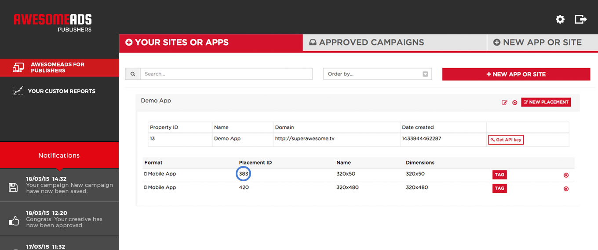

If you haven't already registered your app on the SuperAwesome Dashboard, you can do that by going to [http://dashboard.superawesome.tv](http://dashboard.superawesome.tv). Before we approve your user, you can start testing with our [demo placements](/docs/websdk/Demo%20Placements).

Once your app is registered, you can create placements for it and use the documentation provided below to integrate these placements into your website.